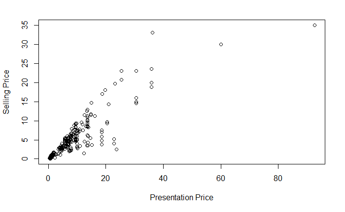
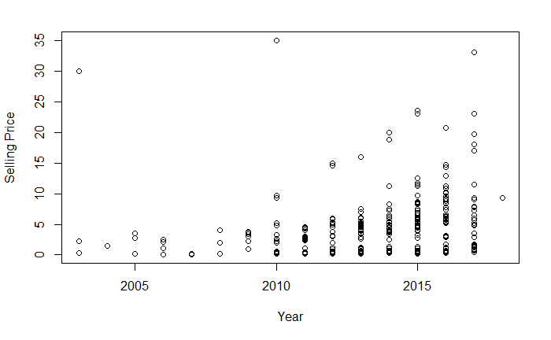
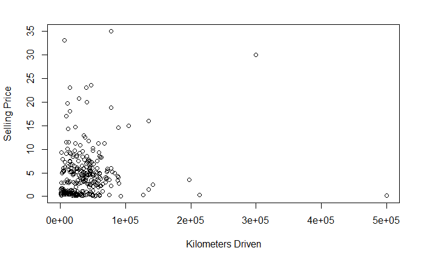
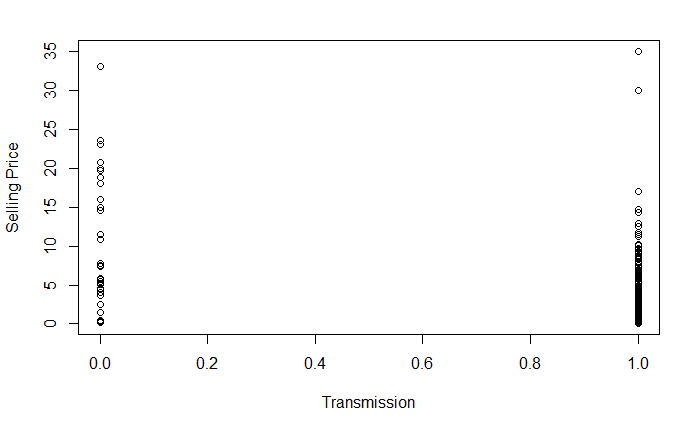
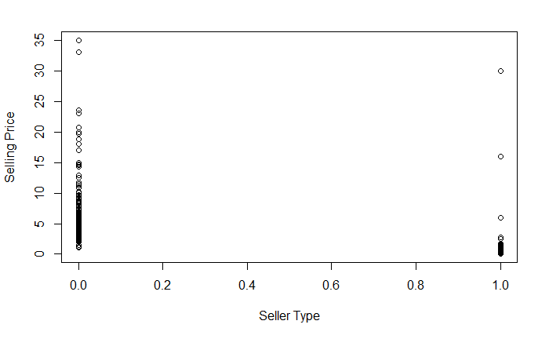
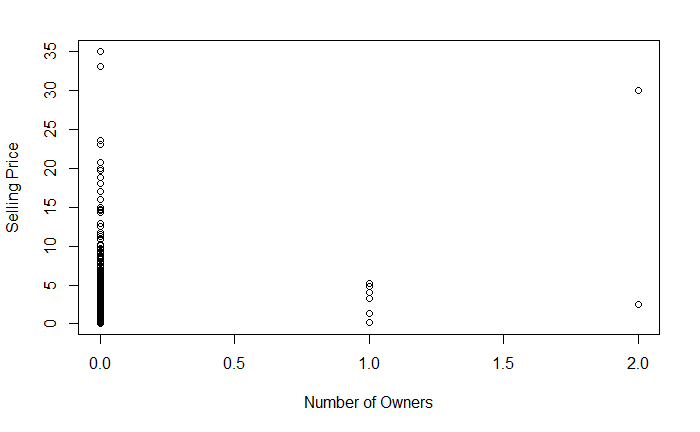
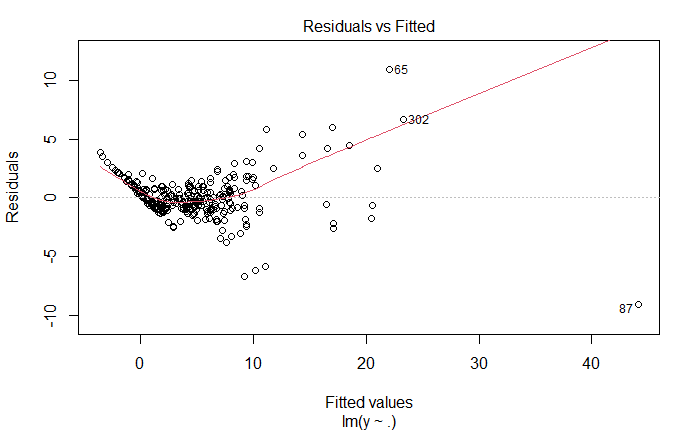
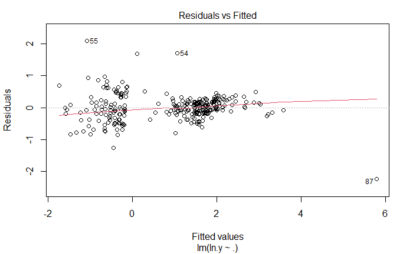

# 3340 Final Project
Eric Reich, 

# Abstract 

# Introduction

# Methods

Three data files, describing car data taken from CarDekho.com were obtained from https://lionbridge.ai/datasets/10-open-datasets-for-linear-regression/.  The data set Car Data.CSV was chosen to analyze. Using R, a new data point was attached to the data frame. N-1 Dummy variable were created for the nonnumeric variables, so 2 for number of sellers and for fuel type, as well as 1 for seller type and transmission type. A new data set was created using the dummy variables replacing their original variables. This data set was then fitted into a linear regression model and summarized using the summary command. The coefficients, R2, t stat p values and f stat p value were analyzed. The model was then checked for multicollinearity. The original indicator variable in the original data set were replaced by variables replacing factors with 0,1 or 2, to make visualization easier. The pairs command was then used on this changed data set and the linearity of each plot was compared. The vif command was then used to discern a numeric value for collinearity. The residuals, leverage and influence were then reflected upon. The linear model was plotted, and the resulting graph analyzed. The H matrix diagonals was used to find leverage at points greater than 2*p/n. The Influence was found via cooks’ distance at point with values greater than 1. After finding issues with variation in the residual plot, the data was transformed. First taking the square root of selling price was tested and found to not change the unequal variance, then ln of y was observed to create better fitting model, so the ln transformation was chosen. Leverage, influence, and a summary of the model were then explored. Using the transformed model, a stepwise comparison was done to ascertain which variables should be kept in the model, as well as comparing all models adjusted R2 to see models that may have equivalent validity. The model produced by the stepwise command was then analyzed via the summary command. A stepwise comparison model removing the Influence point of 87 was then compared to the partial model to visualize the affects of Influence over the model. 

# Results 

Based on the plots there doesn't seem to be strong evidence of multicolinearity. Though logoically I think there are interactions between km driven, year and number of owners. VIF for model with dummy variables fuel and owner variables appear to be multicolinear, but when dummy variable are combined, multicolinearity dissapears.

A srong correlation between presentation price and selling price was observered (Figure 1). Three points appear to be potential outliers, with one of these points significantly higher presentation price than the rest (figure 1). 

 

Figure 1  Presentation Price (Indian Lakhs) vs Selling Price (Indian Lakhs)

There appears to be a positive relationship between year and price, though there are two significant outliers at year 2010 and 2003 (figure 2). there appears to be representives of each year at multiples price ranges at an increasing rate as year increases (figure 2) 

Figure 2  Year vs Selling Price (Indian Lakhs)

There doesn not appear to be a correlation between Kilometers driven and selling price (figure 3). There are 2 noticable outliers (figure 3)

Figure 3  Kilometers Driven vs Selling Price (Indian Lakhs)

Fuel type CNG appears cheaper than the other fuels but has very few representitives (figure 4). Deisel appers to generally have a higher price than petrol (figure 4)

Figure 4  Fuel Type (0=CNG, 1=Deisel, 2=Petrol) vs Selling Price (Indian Lakhs)

The dealer seller type appears to sell more cars and at a generally higher price than individuals (figure 5). There appears to be 1 significant outlier in individual category (fiugure 5)

Figure 5  Seller Type (0=Dealer, 1=Individual) vs Selling Price (Indian Lakhs)

Transmission does not appear to have significant differences between Automatic and Manual, through manual is more concentrated at a lower price with a few outliers, while automatic appears more spread out (figure 6)

Figure 6  Transmission (0=Automatic, 1=Manual) vs Selling Price (Indian Lakhs)

0 owners appears to have higher selling price in general though there are representitives at a wide range (figure 7). 1 owner appears lower and with less data and 3 owners appears to be two extremes with only a few data points (figure 7) 

Figure 7  Number of Owners (0= 0 Owners, 1=1 Owner, 2=3 Owners) vs Selling Price (Indian Lakhs)

After the initial fit of the model, high f statistic and low p vaue showed that the variables have significant affect on selling price, given every variable is included in the model. The t test of KM drivin resulted in high p value, implying this variable may be insignificant. Other variables appeared to be significant in the model, based on t test. points 302, 86 and 87 were noticed as influence points. 

A fanning effect is noted, implying non constant variance amongst residual (figure 8).

Figure 8  Fitted values of full model (y~) vs Residuals

After transforming selling price to ln selling price, ther significance of the variables were similar to the original model, except for transmission. the p value of transmission changed from significant at 0.01 to not significant at 0.618. After transformation, Influence points 86 and 302 no longer appeared at such, though point 87 reamained as an influence point. 

The fanning effect seen in figure 8 is not present, and the data appears more random, though outliers are noticable at point 87 (figure 9). 

Figure 9  Fitted values of ln transformed full model vs Residuals

The stepwise model produced formula:

ln.y = -1.63854*Sell type + 0.05931 * Presentation price + 0.11249 * Year + -0.14385 * Fuel type + 0.15892 * Number of owners

# Conclusion

Based on the stepwise comparison and adjusted R2 of every possible model, presenting price and year are necessary variables. The models with the highest adjusted R2 all had these variables in the model signifying their importance. This falls in line with what was predicted as influencing selling price. 
Km driven did not follow our prediction. The KM variable had high pvalue in the full model and its transformations. In the stepwise model, Km was removed and was the most removed variable in models with high adjusted R2. It was expected the Km would affect the price significantly, as higher km would mean more use and greater possibility of needing work done to maintain the car. It was also predicted that km driven would correlate with number of owners and year, though this was found to not be the case. This may be due to newer model test cars being sold with high km driven. Based on the data found it would be advisable to remove km driven from the model.
Seller type also had significance in the model. It was found that it costs more to purchase from dealers rather than individuals. This would make sense, as dealers often purchase cars from individuals and increase the price to turn a profit. Dealers would also have workers trained to sell, potentially increasing the selling price of vehicles sold. Experience in car sales of individuals seems less likely. 
Number of owners was included in the stepwise comparison model. The affect of number of owners makes sense, as a car with more owners is more likely to be older. A reason that number of owners is possibility of rare or popular vehicles that may change hands often but are still worth a lot, like the data point introduced. Based on the models and comparison there seems to be no reason I can see to remove this from the model. 
The price of fuel was removed in some models with high adjusted R2, though it was used in the stepwise model. It was noticed that Fuel has higher p value even in the final model, so it’s validity in the model is suspect. When exploring CarDekho.com, it was noticed that cars of the same model using diesel were more expensive than those using petrol or CNG. As such including fuel into the model does seems appropriate.
In the stepwise model, transmission was not included, though it was included in some of the models with high adjusted R2. When viewing the summary of the full, transformed model, transmission type p value was not significant implying that it does not play a significant role in the model. Similar to fuel type, when reviewing the differences in price on CarDekho.com it was noticed that automatic cars of the same make and model were more expensive than manual cars. As such there is precedent to consider models that either include or remove transmission type from the model. 
The affect of influence of point 87 was also analyzed to see if it had any affect on which variables were removed from the model. Point 87 is a land cruiser, which are expensive vehicles. The results implied that point 87 decreased the adjusted R2 but did not affect the variables found within the model. It is recommended that point 87 remain in the model. 
Possible points of error could be found in the lack of variables available for the model. Car prices often reflect the technologies incorporated into the vehicle, while this may be absorbed by the newness of the vehicle in years, it is apparent that cars from the same year may have drastically different add-ons affecting their cost. This model also does not include the brand which would potentially have significant affect on price of cars with similar attributes. 

